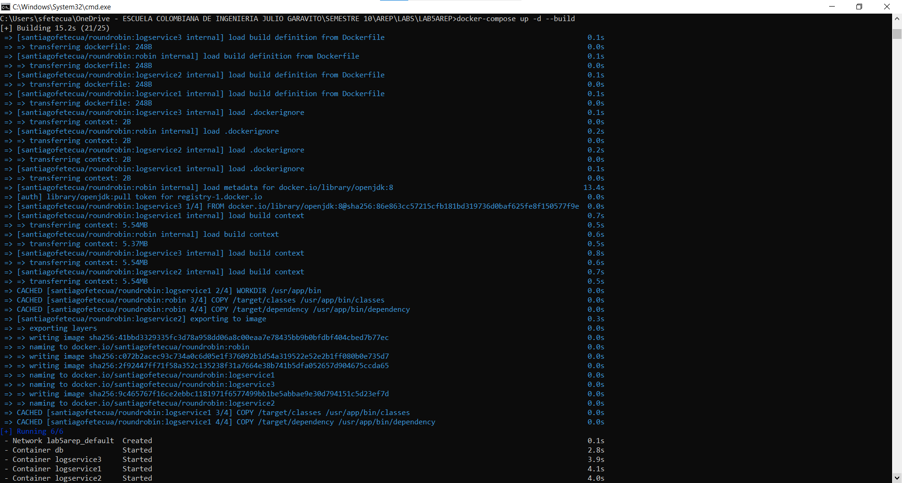

# LAB5AREP

Quinto taller de la asignatura, en este se aplicaron conocimientos de HTTP, HTML, Docker, AWS, MAVEN, GIT.

### Prerrequisitos

Para ejecutar el laboratorio se debe tener instalado:

```
- Java
- Maven
- Git
- Docker
```

### Instalación

Debe usarse el comando git clone para descargar el repositorio

```
git clone https://github.com/santiago-f20/LAB5AREP
```
Una vez descargado, en la carpeta del proyecto se deben ejecutar los siguientes comandos para compilar el proyecto

```
cd logservice
mvn clean install
cd ..
cd roundrobin
mvn clean install
cd ..
docker-compose up -d --build
```




Una vez iniciado el servidor, se puede acceder a la pagina web en el siguiente link

```
http://localhost:35000/
```


## AWS

Para desplegar el proyecto en AWS se siguió el siguiente proceso

* Push a repositorio en DockerHub


* Se creó una instancia EC2 en AWS, se instaló docker en la maquina y se puso a correr el proyecto


## Documentación

Para generar la documentación del proyecto se debe ejecutar el siguiente comando

```
mvn javadoc:javadoc
```
Para ver la documentación se debe abrir el archivo index.html que se encuentra en la carpeta target/site/apidocs

### Estructura del proyecto

```
.
|
├───logservice
│   │   Dockerfile
│   │   pom.xml
│   │
│   ├───src
│   │   ├───main
│   │   │   └───java
│   │   │       └───co
│   │   │           └───edu
│   │   │               └───escuelaing
│   │   │                   └───app
│   │   │                           App.java
│   │   │
│   │   └───test
│   │       └───java
│   │           └───co
│   │               └───edu
│   │                   └───escuelaing
│   │                       └───app
│   │                               AppTest.java
│   │
│   └───target
│       ├───classes
│       │   └───co
│       │       └───edu
│       │           └───escuelaing
│       │               └───app
│       │                       App.class
│       │
│       └───test-classes
│           └───co
│               └───edu
│                   └───escuelaing
│                       └───app
│                               AppTest.class
│
└───roundrobin
    │   Dockerfile
    │   pom.xml
    │
    ├───src
    │   ├───main
    │   │   ├───java
    │   │   │   └───co
    │   │   │       └───edu
    │   │   │           └───escuelaing
        │   │
        │   └───public
        │           index.html
        │
        └───test-classes
            └───co
                └───edu
                    └───escuelaing
                        └───app
                                AppTest.class

```

## Construido con

* [Maven](https://maven.apache.org/) - Dependency Management
* [JAVA](https://www.java.com/es/download/) - Lenguaje de programación

## Autor

* **Santiago Fetecua** - [santiago-f20](https://github.com/santiago-f20)